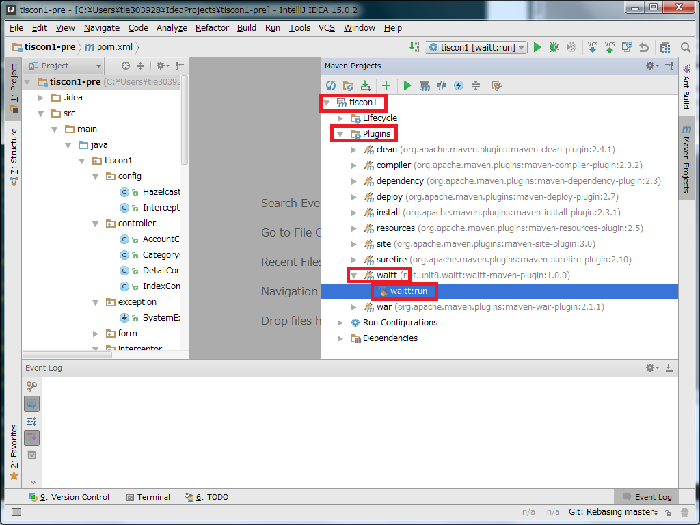

# 環境構築手順
本ドキュメントではtisconプロジェクト動作に必要となる環境構築の手順を示します。  
環境構築を行うに当たり、インターネット接続した状態で行って下さい。  
  
また、本ドキュメントは環境構築対象PCのOSがWindowsを想定しています。  
他のOSの場合は、各自適した設定を行うようにしてください。  
  
作業想定時間は3~4時間です。  
環境構築が完了しないまま参加した場合、インターン当日環境構築に大きく時間を割かれることとなります。  
不測の事態や不明点があった際に問い合わせる時間も考慮し、余裕をもって準備しておくよう心掛けてください。  

## 事前準備

### 自身の環境確認
下記サイトを参考に、PCで32bit版、64bit版のいずれを実行しているのかを調べます。  
[【Windowsの32bit版または64bit版のいずれを実行しているのか調べる】](http://windows.microsoft.com/ja-jp/windows7/find-out-32-or-64-bit)  

どちらで実行しているかにより、以降の作業でのインストール先が異なる場合があります。  
特に指定が無い場合、インストール先はデフォルトの設定で問題ありません。  

### ファイルの拡張子表示
下記サイトを参考に、拡張子を表示するよう設定してください。  
[【Windowsで拡張子を表示させる】](https://www.microsoft.com/ja-jp/atlife/tips/archive/windows/tips/252.aspx)

## JDK8
Java(プログラミング言語)で開発を行うのに必要なソフトウェアをまとめたパッケージです。  
下記サイトを参考に、**JDK8のインストール**及び**環境変数の設定**を行って下さい。  

※**環境変数の「Path」を編集する場合、もともと記載されている設定は消さないでください。**  
  消すとPCが動かなくなる場合がありますので、必要な設定の**追記**のみ行ってください。  
※下記サイトに記載されたjdkのバージョンは最新ではありません(jdk-8u5)。  
  最新のバージョンをダウンロードしてください。10月末日時点での最新バージョンはjdk-8u112です。  
※環境変数のパス設定には、自身がインストールした先のパスを設定するよう注意してください。  
  
[【JDK8(Java8)のインストール方法】](http://javaworld.helpfulness.jp/post-24/)  

## Maven3
Apache Software Foundationで開発されているソフトウェアプロジェクト管理ツールです。  
下記サイトを参考に、**Maven3のインストール**及び**環境変数の設定**を行って下さい。  
下記サイトには「環境変数の設定は3つ」と記載がありますが、この項目でのJAVA_HOME、M2_HOMEの設定は不要です。  
今回は環境変数「PATH」1つのみの設定を行って下さい。  

※**環境変数の「Path」を編集する場合、もともと記載されている設定は消さないでください。**  
　消すとPCが動かなくなる場合がありますので、必要な設定の**追記**のみ行ってください。  
※ファイルの展開先は以下の様に設定してください。  
`C:\Program Files`  
環境変数のパス設定には、展開先のパスを反映するよう注意してください。  
  
[【Apache Maven3 (3.2.5) インストール手順】](http://weblabo.oscasierra.net/install-maven-32-windows/)  

## IntelliJ IDEA
JetBrains社が開発した統合開発環境です。  
下記サイトを参考に、**IntelliJ IDEAのCommunity Editionをインストール**してください。  
また、併せてProject Settingsより**JDKの設定**を行って下さい。  

※下記サイトに記載されているIntelliJ IDEAに関する項目のみ参照してください。JDKとGitの設定は別途行うので、不要です。  
  
※下記サイトに記載されたIntelliJのバージョンは最新ではありません(14.0.2)。  
  最新のバージョンをダウンロードしてください。1月末日時点での最新バージョンは15.0.3です。  

※環境変数のパス設定には、Javaの設定を含め、自身がインストールした先のパスを設定するよう注意してください。  

※下記サイトは64bit版について記載されています。  
32bitの場合は初回起動時、「idea64.exe」ではなく同フォルダに存在する「idea.exe」を実行してください。  

[【IntelliJ IDEA 14.0.2 インストール手順】](http://ksby.hatenablog.com/entry/2014/12/27/233427)  
  
IntelliJを日本語化したい場合は下記を参考にしてください。  
※jarファイルコピー先のフォルダには、自身がインストールしたパスの情報を反映させてください。  
[【IntelliJ IDEA 日本語化】](http://qiita.com/makoto2468/items/6abf614b82cab865b745)  

### プラグインの設定
1. IntelliJを起動し、Configure > Settings を選択します。  
  

1. Settingsウィンドウが表示されるので、左のバーからPluginsを選択し、Browse repositories...ボタンを押下します。  
  

1. 検索バーに`Lombok`と入力し、Lombok Pluginを選択します。  
   右側に表示されるInstallボタンを押下してください。  
   ※検索結果が表示されない場合はプロキシ問題である可能性があります。  
   [参考 - プロキシ](ProxyGuide.md)の設定を参照してください。  

  

1. 同様に、検索バーに`Jackson`と入力し、Jackson Generator Pluginを選択します。  
   右側に表示されるInstallボタンを押下し、**IntelliJを再起動**してください。  

## Heroku
PaaSの1つであり、Webアプリケーションのオンライン上での公開を行えるプラットフォームです。  

### アカウント作成
下記サイトの「herokuのアカウント作成」を参考に、アカウント作成を行って下さい。  
　※下記サイトのHerokuトップページが過去のスクリーンショットとなっています。  
　　現在HerokuのトップページにはSIGN UP FOR FREEというボタンがあるので、そちらを押下してアカウント作成ページに遷移してください。  

[【Herokuの準備】](http://www.dcom-web.co.jp/technology/heroku1/)  

### heroku toolbeltのインストール
下記サイトの「heroku toolbeltのインストール」を参考に、heroku toolbeltのインストール及び動作確認を行って下さい。  
　※「1.インストーラーのダウンロード」と「2.動作確認」まで行って下さい。  
　　「3. heroku認証確認」以降は実施しないでください。  
　　下記サイトでは、ダウンロードページのスクリーンショットが最新ではありません。  
　　ダウンロードページの[Download and install]以下からOSに合ったファイルをダウンロードしてください。  

[【Herokuの準備】](http://www.dcom-web.co.jp/technology/heroku1/)  

### Gitの動作確認
前項のHerokuのインストールが正常に完了すると、同時にGitがインストールされます。  
正常にGitがインストールされているかを確認するために、以下の手順を実施してください。  
スタート > すべてのプログラム > アクセサリ > コマンドプロンプトを選択してください。  
コマンドに`git --version`と入力し、gitのバージョン情報が表示されれば正常にインストールできています。

## Github
Gitリポジトリのホスティングサービスです。  
Gitに関して深く学びたい場合は、下記サイトを参照し理解に役立ててください。  
- [【Git入門】](http://www.backlog.jp/git-guide/intro/intro1_1.html)  
- [【ギットクエスト】](http://unit8.net/gq/)  

### アカウント作成
下記サイトを参考に、**Githubのアカウント作成**を行って下さい。  
※GithubはSEのSNSであり、GithubアカウントはSEにとって名刺のようなものです。  
 一生モノのアカウント名に気を付けて作成してください。  
[【GitHub アカウントの作成方法】](http://fnya.cocolog-nifty.com/blog/2014/01/github-185e.html)

### tisconのFork
[Github](https://github.com/)にログインし、下記ページの右上にあるForkボタンを押下してください。  
[【tiscon - Githubページ】](https://github.com/tiscon/tiscon1)  

## 動作確認
環境構築したPCでWebアプリケーションが正常に動作をするか確認します。  
当日はローカルで動作を確認しながらコードの修正を行っていきます。  

### IntelliJでのプロジェクトのclone手順
1. ユーザフォルダ配下にIdeaProjectsフォルダを作成します。(例)C:\Users\ユーザ名\IdeaProjects
1. IntelliJを起動し、Check out from Version Control > Git を選択します。
1. Git Repository URLに以下を入力します。  
   `https://github.com/[Githubのユーザ名]/tiscon1.git`
1. Cloneボタンを押下します。
   ※「The parent path～」と表示されている場合、Parent Directory項目右の…ボタンを押下し、作成したIdeaProjectsフォルダを選択してください。
1. 画面下部にステータスが表示されるます。バーの表示が消えればcloneは完了です。
   

### ソースコード確認
1. IntelliJ上部メニューバーから、View > Tool Windows > Projectを選択します。

1. Project Viewよりプロジェクト内のソースコードが確認できるようになりました。

### ローカルでの動作確認
cloneしたwebアプリケーションが正常に動くか、ローカル上で動作確認を行います。  
1. IntelliJ上部メニューバーから、View > Tool Windows > Maven Projectsを選択します。

1. 上部のMake Projectボタンを押下し、画面下部に全てのファイルが最新であることを示すメッセージが表示されることを確認します。

2. Maven Project Viewより、tiscon > Plugins > waitt > waitt:run をダブルクリックしてください。  
   画面下部にログが表示されます。「StaticResourceHandler　（中略） = /public」と表示されたらアプリケーションが起動しています。  
   ブラウザから http://localhost:8080 にアクセスすることでトップページが開きます。  
   ※初回実行時は数分かかりますが、以降は10秒ほどでアプリケーションが起動します。  
  

WAITTに関しては下記記事をお読みください。  
[【Webアプリ開発/テストのお供に『WAITT』】](http://qiita.com/kawasima/items/1d4daed6f980b4bfbee3)  

### オンライン上での動作確認
Heroku上にデプロイし、オンラインで動作することを確認しましょう。  
Herokuにログインした状態で、tiscon1内のREADME>[環境構築]にある、デプロイボタン(Deploy to Heroku)を押下してください。
※HerokuへのログインはHerokuのホームページから行って下さい。

### 作業に行き詰った場合
環境構築にあたり自身で調べても上手くいかない場合は、下記のテンプレートを用いてメールにて質問してください。  
何が上手くいっていないかわからない、などの場合も一度スクリーンショットと環境構築手順書のどの手順で分からなくなったのかをお送りいただければと思います。  
内容に応じてメールもしくは電話でサポートします。  

  
---------- テンプレート ここから ----------  
メールアドレス：  
　tiscon@ml.tis.co.jp  
件名：  
　【インターン環境構築】[作業名]が上手くいきません。  
本文：  
TIS インターン ITアーキテクトコース 実施担当者様  
  
[所属大学]の[氏名]です。  
  
[参加予定日]のインターン実施に向け、環境構築を行っていましたが、[作業名]が上手くいきません。  
  
【作業状況】  
（※環境構築手順のどこまで進めたか記載）  
  
【問題】  
（※何が上手くいっていないのか、どのようなエラーが出ているのか記載）  
  
【連絡先】  
（※日中連絡がとれる電話番号）  
  
以上です、ご返答の程お願いいたします。  
  
---------- テンプレート ここまで ----------  
  
---------- 例文 ここから ----------  
メールアドレス：  
　tiscon@ml.tis.co.jp  
件名：  
　intelliJの日本語化が上手くいきません。  
本文：  
TIS インターン ITアーキテクトコース 実施担当者様  
  
ADC大学の奈部 楽太郎です。  
  
2/11(祝)、12(金)のインターン参加に向けて、環境構築を行っていますが  
環境構築手順書の[IntelliJ IDEA 日本語化]のサイトに記載してある  
通りに作業をしたのですが、日本語化が上手くできません。  
  
【作業状況】  
参照先の手順はすべてやったのですが、自分のPCに以下のフォルダが見つからず、  
自分で新規フォルダを作成したのですが、うまく動きません。  

サイトに書いてあるフォルダ名(この通りに新規のフォルダを作成しました)  
C:\Program Files (x86)\JetBrains\IntelliJ IDEA Community Edition 14.1.4\lib  

私のPCにできていたフォルダ名  
C:\Program Files\JetBrains\IntelliJ IDEA Community Edition 14.1.4\lib  

【問題】  
なぜか日本語化されていない。  
何も変わっていないように見える。  
  
【連絡先】  
0X0-XXXX-XXXX  
15時以降であれば何時でも大丈夫です。  
  
以上です、ご返答の程お願いいたします。  
  
---------- 例文 ここまで ----------  
