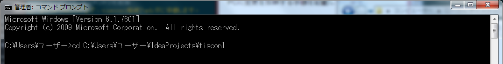
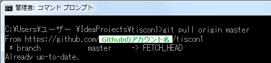
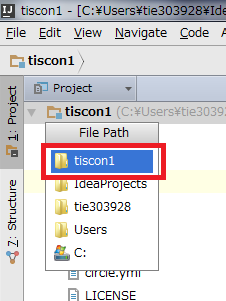
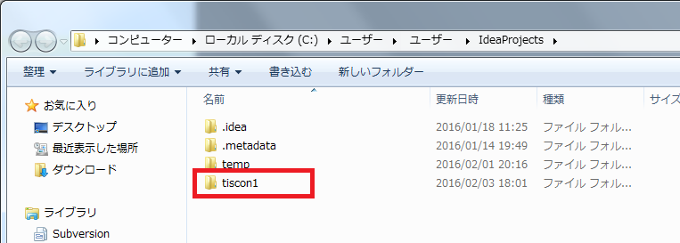
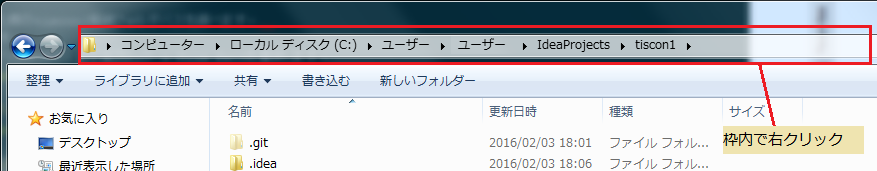
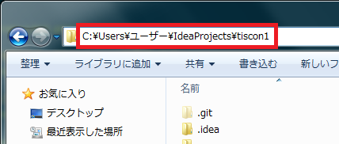

# 更新手引き

本ガイドはGithub上のtiscon1に更新があった場合に、自身のPCに変更を反映する手順を記載しています。  

1. tiscon1格納フォルダへ移動
コマンドプロンプト上で、`cd [tiscon1格納フォルダ]`を実行してください。  

※コマンドプロンプトの起動方法は本ガイドの「参考-コマンドプロンプトの起動方法」を参照してください。  
※tiscon1格納フォルダは、本ガイドの「参考-tiscon1格納フォルダパスの確認」を参照してください。  
※コマンドプロンプト上にコピーした文字列を張り付ける場合、右クリック > 貼り付け を選択してください。  

1. ローカルの最新化
https://github.com/tiscon/tiscon1から最新の状態を取得、反映します。  
`git pull https://github.com/tiscon/tiscon1 master`を実行してください。  

1. Githubの最新化
最新化したローカルの状態を自身のGithubに反映します。  
`git push origin master`を実行してください。  
※ユーザ名とパスワードは自身のGithubのアカウント情報を入力してください。  
この作業終了後、Githubのマイページが最新化されていることが確認できます。  
https://github.com/[Githubアカウント名]/tiscon1

1. 最新状態での動作確認
環境構築手順内の「ローカルでの稼働確認」を行い、更新が反映されていることを確認してください。  
[【環境構築手順書】](https://github.com/tiscon/tiscon1-doc/)

## 参考

### コマンドプロンプトの起動方法

スタート > すべてのプログラム > アクセサリ > コマンドプロンプトを選択してください。

### tiscon1格納フォルダパスの確認

Githubからcloneしてきた際のtiscon1格納フォルダパスを調べます。  

1. IntelliJを起動します。

1. Project View > 「tiscon1」上で右クリック > File Pathを選択します。

1. tiscon1を選択します。

1. tiscon1の格納フォルダが開きます。さらにtiscon1を選択します。

1. 上部のボックス上で右クリック > アドレスの編集を選択すると、tiscon1の格納フォルダパスが表示されます。

画像例では`C:\Users\ユーザー\IdeaProjects\tiscon1`がtiscon1の格納フォルダパスです。

 

 

